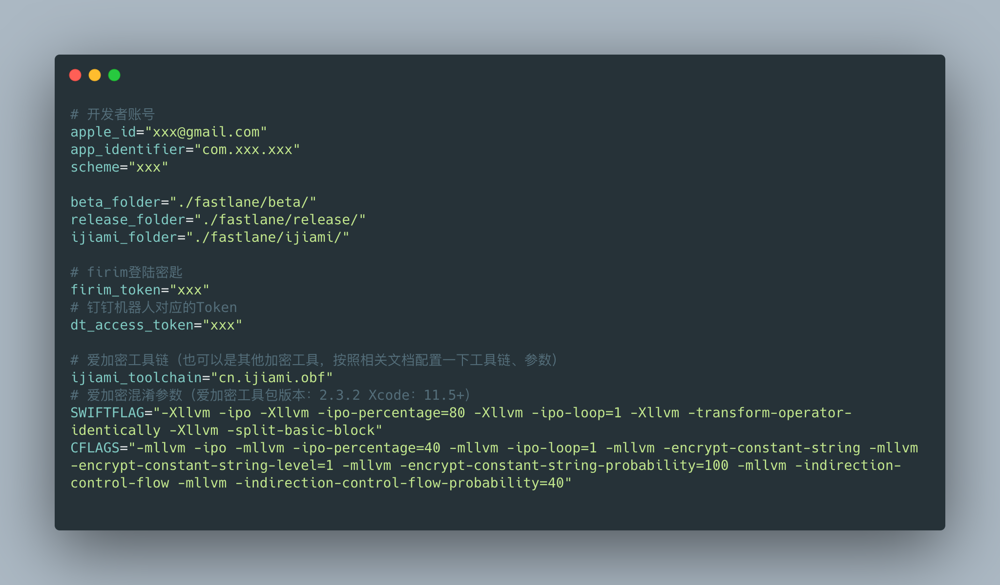

<!--
 * @Description: In User Settings Edit
 * @Author: your name
 * @Date: 2018-09-08 11:40:23
 * @LastEditTime: 2019-08-16 10:36:51
 * @LastEditors: Please set LastEditors
 -->

# Instructions
1. Copy `fastlane` folder、`Gemfile` `Gemfile.lock` file to your project root directory.
2. Configuration information `.env`
   
3. Run with commands `bundle exec fastlane beta`, You can also change the specified action.


# Available Actions
## iOS
### ios set_build_number
```
bundle exec fastlane ios set_build_number
```
build number
### ios beta
```
bundle exec fastlane ios beta
```
build a beta ipa
### ios betaijm
```
bundle exec fastlane ios betaijm
```
build a ijiami beta ipa
### ios release
```
bundle exec fastlane ios release
```
build a release ipa
### ios releaseijm
```
bundle exec fastlane ios releaseijm
```
build a ijiami release ipa
### ios submit_review
```
bundle exec fastlane ios submit_review
```
upload binary to iTC (and maybe submit review)
